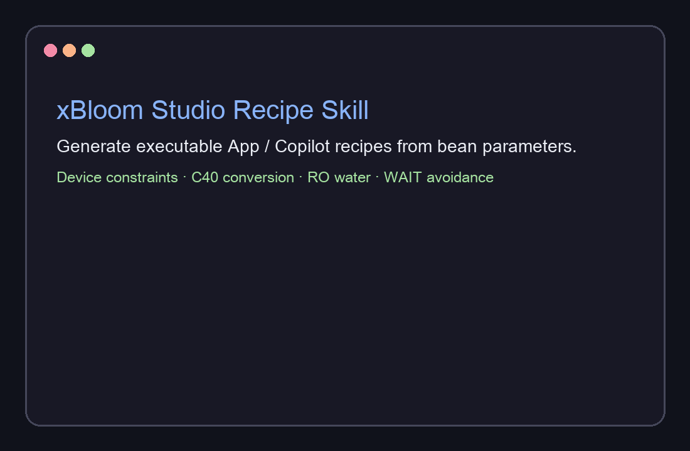

# xBloom Studio 冲煮方案 Skill

[](SKILL.md)
[](https://skills.sh/ryunana/xbloom-studio-recipe-skill)
[](LICENSE)

这是一个 Hermes Agent Skill，用于根据咖啡豆基础参数，生成可直接填入 xBloom Studio App / Copilot 创作模式的完整冲煮方案。



这个 Skill 内置了 xBloom Studio 的真实设备约束与手冲调参逻辑，包括：

- xBloom Studio 的粉量、研磨、RPM、流速、温度、注水模式与振动限制
- xBloom Studio ↔ Comandante C40 的官方研磨转换锚点
- RO 水补偿规则
- Omni Dripper / 平底滤杯注水逻辑
- WAIT / 防溢出避坑
- 埃塞日晒 / 花香莓果型咖啡的配方 archetype
- 针对偏酸、偏苦涩、风味空薄的“每次只改一个变量”修正路线

## 安装

仓库发布后，可以通过 Skills CLI 从 GitHub 安装：

```bash
npx skills add ryunana/xbloom-studio-recipe-skill -g
```

也可以手动安装：

把本仓库复制到你的 Hermes skills 目录，例如：

```bash
mkdir -p ~/.hermes/skills/leisure/xbloom-studio-recipe
cp SKILL.md ~/.hermes/skills/leisure/xbloom-studio-recipe/SKILL.md
```

然后开启一个新的 Hermes 会话，直接请求生成 xBloom Studio 冲煮方案即可。

## 示例 Prompt

```text
用 xbloom-studio-recipe 给这支豆子出一套 xBloom Studio App 可直接填写的方案：
ETHIOPIA DUWANCHO / 74158 / Natural / 花香、杨梅、蔓越莓、橙子、油桃、青芒。默认 15g、240ml、RO 水。
```

## 输出内容

默认输出为简体中文，结构包括：

1. 基础参数
2. 分段注水参数
3. 目标总萃取时间
4. 理论风味顺序
5. 三条翻车修正路线（每条只改一个变量）

## 校验

```bash
bash scripts/validate.sh
```

## 资料来源与依据

这个 Skill 基于 xBloom 官方文档、xBloom Studio / C40 研磨转换数据、xBloom App 参数限制、Nucleus Coffee 的 xBloom Studio 控制变量笔记、Standout Coffee 的 xBloom Studio dial-in 案例，以及公开的研磨档位参考资料整理而成。

更多研究笔记和来源类别见 [SOURCES.md](SOURCES.md)。

本仓库与 xBloom 没有关联，也未获得 xBloom 的赞助、背书或官方认可。

## 许可证

MIT。详见 [LICENSE](LICENSE)。
